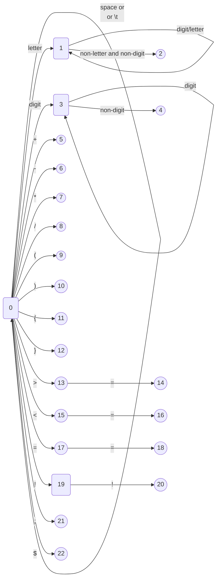

# C_Compiler_Project

## Introduction

Compiler Design Course Project - Grammar Design & Lexical Analysis & LL(1) Syntax Analysis & Semantic Analysis (Syntax-Directed Translation)

## Grammar Design

### Terminal Symbols

`main` `int` `if` `else` `return` `+` `-` `*` `/` `=` `equal` `less_than` `less_euqal` `great_than` `great_equal` `not_equal` `(` `)` `{` `}` `id` `digit` `;` `$`

### Non-terminal Symbols

`<program>` `<main_function>` `<return_type>` `<variable_type>` `<compound_statement>` `<statement_sequence>` `<statement>` `<statement_recursive>` `<declaration_statement>` `<assign_initial_value>` `<assignment_statement>` `<conditional_statement>` `<boolean_expression>` `<expression>` `<term>` `<term_recursive>` `<factor>` `<factor_recursive>` `<relation_operator>` `<identifier>` `<unsigned_constant>`

### Grammar Productions

| Non-terminal Name |                                  Production                                  |
| :----------------: | :-------------------------------------------------------------------------: |
|      program       |                         `<program>` ::= `<main_function>` $                          |
|    main_function    |            `<main_function>` ::= `<return_type>` main ( ) `<compound_statement>`            |
|    return_type      |                        `<return_type>` ::= `<variable_type>`                         |
|    variable_type    |                            `<variable_type>` ::= int                            |
| compound_statement  |                  `<compound_statement>` ::= { `<statement_sequence>` }                   |
| statement_sequence  |                  `<statement_sequence>` ::= `<statement>` `<statement_recursive>` \| ε |
|      statement      | `<statement>` ::= `<declaration_statement>` \| `<assignment_statement>` \| `<conditional_statement>` \| `<compound_statement>` \| return `<expression>` ; |
| statement_recursive |                  `<statement_recursive>` ::= `<statement>` `<statement_recursive>` \| ε |
| declaration_statement |             `<declaration_statement>` ::= `<variable_type>` `<identifier>` `<assign_initial_value>` ;             |
| assign_initial_value  |                         `<assign_initial_value>` ::= = `<expression>` \| ε                          |
| assignment_statement  |                    `<assignment_statement>` ::= `<identifier>` = `<expression>`;                    |
| conditional_statement | `<conditional_statement>` ::= if ( `<boolean_expression>` ) `<compound_statement>` else `<compound_statement>` |
| boolean_expression   |           `<boolean_expression>` ::= `<expression>` `<relation_operator>` `<expression>`           |
|      expression      |                          `<expression>` ::= `<term>` `<term_recursive>`                           |
|         term         |                             `<term>` ::= `<factor>` `<factor_recursive>`                             |
|    term_recursive    |     `<term_recursive>` ::= + `<term>` `<term_recursive>` \| - `<term>` `<term_recursive>` \| ε      |
|  factor_recursive    | `<factor_recursive>` ::= * `<factor>` `<factor_recursive>` \| / `<factor>` `<factor_recursive>` \| ε |
|        factor        |                 `<factor>` ::= `<identifier>` \| `<unsigned_constant>` \| ( `<expression>` )                 |
| relation_operator    | `<relation_operator>` ::= equal \| less_than \| less_equal \| great_than \| great_equal \| not_equal |
|     identifier      |                        `<identifier>` ::= id                        |
| unsigned_constant    |                    `<unsigned_constant>` ::= digit                    |

**Note:**

The explicit `$` is used as an end symbol in the grammar.

## Lexical Analysis (LexAnalyse)

Lexical analysis is based on the following DFA:

## Syntax Analysis (SynAnalyse)

### First Sets

| Non-terminal | First Set |       |       |       |       |       |       |
| :----------: | :-------: | :---: | :---: | :---: | :---: | :---: | :---: |
|   `<program>`   |    int    |       |       |       |       |       |       |
| `<main_function>` |    int    |       |       |       |       |       |       |
| `<return_type>`  |    int    |       |       |       |       |       |       |
| `<variable_type>` |    int    |       |       |       |       |       |       |
| `<compound_statement>` |     {     |       |       |       |       |       |       |
| `<statement_sequence>` |    int    |   id  |   if  |   {   | return |   ε   |       |
| `<statement>` |    int    |   id  |   if  |   {   | return |       |       |
| `<statement_recursive>` |    int    |   id  |   if  |   {   | return |   ε   |       |
| `<declaration_statement>` |    int    |       |       |       |       |       |       |
| `<assign_initial_value>` |     =     |   ε   |       |       |       |       |       |
| `<assignment_statement>` |    id     |       |       |       |       |       |       |
| `<conditional_statement>` |    if     |       |       |       |       |       |       |
| `<boolean_expression>` |    id     | digit |   (   |       |       |       |       |
| `<expression>` |    id     | digit |   (   |       |       |       |       |
| `<term_recursive>` |     +     |   -   |   ε   |       |       |       |       |
| `<term>` |    id     | digit |   (   |       |       |       |       |
| `<factor_recursive>` |     *     |   /   |   ε   |       |       |       |       |
| `<factor>` |    id     | digit |   (   |       |       |       |       |
| `<relation_operator>` |  equal  | less_than | less_equal | great_than | great_equal | not_equal |       |
| `<identifier>` |    id     |       |       |       |       |       |       |
| `<unsigned_constant>` |  digit  |       |       |       |       |       |       |

### Follow Sets

| Non-terminal | First Set |       |       |       |       |       |       |       |       |       |       |       |       |       |
| :----------: | :-------: | :---: | :---: | :---: | :---: | :---: | :---: | :---: | :---: | :---: | :---: | :---: | :---: | :---: |
| `<program>` |       |       |       |       |       |       |       |       |       |       |       |       |       | $     |
| `<main_function>` | $     |       |       |       |       |       |       |       |       |       |       |       |       |       |
| `<return_type>` | main  |       |       |       |       |       |       |       |       |       |       |       |       |       |
| `<variable_type>` | main  |   id  |       |       |       |       |       |       |       |       |       |       |       |       |
| `<compound_statement>` | $     |       |       |       |       |       |       |       |       |       |       |       |       |       |
| `<statement_sequence>` |   }   |       |       |       |       |       |       |       |       |       |       |       |       |       |
| `<statement>` |    int    |   id  |   if  |   {   | return |   }   |       |       |       |       |       |       |       |       |
| `<statement_recursive>` |   }   |       |       |       |       |       |       |       |       |       |       |       |       |       |
| `<declaration_statement>` |   int   |   id  |   if  |   {   | return |   }   |       |       |       |       |       |       |       |       |
| `<assign_initial_value>` |   ;   |       |       |       |       |       |       |       |       |       |       |       |       |       |
| `<assignment_statement>` |    int    |   id  |   if  |   {   | return |   }   |       |       |       |       |       |       |       |       |
| `<conditional_statement>` |    int    |   id  |   if  |   {   | return |   }   |       |       |       |       |       |       |       |       |
| `<boolean_expression>` |   )   |       |       |       |       |       |       |       |       |       |       |       |       |       |
| `<expression>` |   ;   | equal | less_than | less_equal | great_than | great_equal | not_equal |   )   |       |       |       |       |       |       |
| `<term_recursive>` |   ;   | equal | less_than | less_equal | great_than | great_equal | not_equal |   )   |       |       |       |       |       |       |
| `<term>` |     +     |   -   |   ;   | equal | less_than | less_equal | great_than | great_equal | not_equal |   )   |       |       |       |       |
| `<factor_recursive>` |     +     |   -   |   ;   | equal | less_than | less_equal | great_than | great_equal | not_equal |   )   |       |       |       |       |
| `<factor>` |     *     |   /   |     +     |     -     |   ;   | equal | less_than | less_equal | great_than | great_equal | not_equal |   )   |       |       |
| `<relation_operator>` |   id   | digit |   (   |       |       |       |       |       |       |       |       |       |       |   )   |
| `<identifier>` |     =     |   *   |   /   |     +     |     -     |   ;   | equal | less_than | less_equal | great_than | great_equal | not_equal |   )   |
| `<unsigned_constant>` |     *     |   /   |     +     |     -     |   ;   | equal | less_than | less_equal | great_than | great_equal | not_equal |   )   |

### LL(1) Parsing Table

Omitted (it can be inferred that there are no conflicts in this grammar)

### Summary

Due to limited space, First sets and Follow sets are generated manually, and then recursive descent parsing is implemented based on the generated sets.

If the proficiency is sufficient, consider generating First sets and Follow sets programmatically and then generating an LL(1) parsing table. Parsing can be performed based on the symbol stack and word stack.

In general, syntax analysis cannot continue when a syntax error is detected. In other words, only one syntax error can be recognized. In this code, some possible syntax error predictions are added to discover as many syntax errors as possible without affecting subsequent processing, improving efficiency.

## Semantic Analysis (Syntax-Directed Translation)

On top of the recursive descent parsing in syntax analysis, a series of actions are inserted to translate expressions into quadruple intermediate code (not adopting triple notation for specific reasons, and there is a certain consideration for the jump statements in `if...else...` blocks).

### Quadruple Representation

`(<statement_number>) <action> <first_input> <second_input> <output>`

**Note:**

1. If a cell is empty, the underscore `_` is used to represent it.

2. Temporary variables are represented as `Ti`, such as the 0th generated temporary variable denoted as `T0` (there is a mechanism for temporary variable recycling in the code).

An example (random statement number, for illustration purposes):

- Declaration statement: `(1) assign int _ i` represents the identifier `i` being declared as type `int`.

- Logical operation: `(2) + i + 1 T0` represents `T0 = i + 1`.

- Assignment statement: `(3) = 1 _ i` represents `i = 1`.

- Conditional branch: `(4) < i j T0` represents `T0 = i < j`.

- Non-true jump: `jne` means `jump not equal true`, `(5) jne T0 _ (6)` represents jumping to statement 6 when T0 is false.